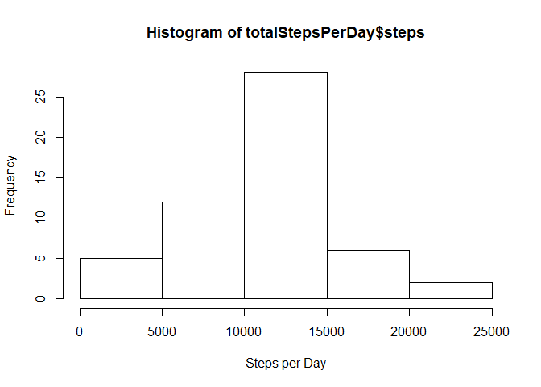
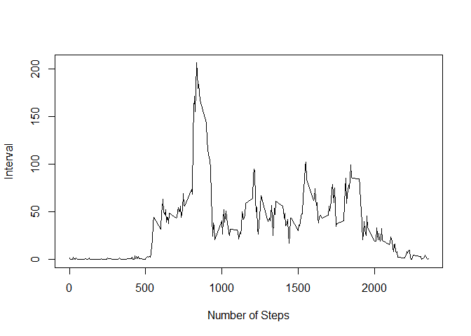
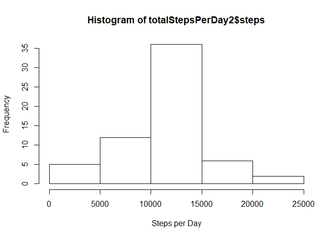

## Loading and preprocessing the data


```r
unzip("activity.zip")
activity <- read.csv("activity.csv")
activity$date <- as.POSIXct(activity$date)
library("ggplot2")
```

```
## Warning: package 'ggplot2' was built under R version 3.4.4
```

```r
library("lattice")
```

## What is mean total number of steps taken per day?


```r
# calculate the total steps per day
totalStepsPerDay <- aggregate(steps ~ date, activity, sum)
# plot a histogram of all the steps per day
hist(totalStepsPerDay$steps, xlab="Steps per Day")
```

<!-- -->

```r
# output the mean and median steps per day
print("Mean")
```

```
## [1] "Mean"
```

```r
mean(totalStepsPerDay$steps)
```

```
## [1] 10766.19
```

```r
print("Median")
```

```
## [1] "Median"
```

```r
median(totalStepsPerDay$steps)
```

```
## [1] 10765
```

## What is the average daily activity pattern?


```r
# create a time series plot of average steps per each 5 minute interval
avgStepsPerInterval <- aggregate(steps ~ interval, activity, mean)
plot(avgStepsPerInterval$interval, avgStepsPerInterval$steps, type="l", xlab="Number of Steps", ylab="Interval")
```

<!-- -->

```r
# find the time interval with the average maximum steps
maxIndex <- match(max(avgStepsPerInterval$steps), avgStepsPerInterval$steps)
print("5 Min Interval with Max Average Steps")
```

```
## [1] "5 Min Interval with Max Average Steps"
```

```r
avgStepsPerInterval$interval[maxIndex]
```

```
## [1] 835
```


## Imputing missing values


```r
# count the number of NAs in the data
print("Number of NAs in Data")
```

```
## [1] "Number of NAs in Data"
```

```r
sum(is.na(activity$steps))
```

```
## [1] 2304
```

```r
# we will fill in the missing values with the average number of steps from that time interval

# create a new dataset
activity2 <- activity

# get a joined table with the average steps per time interval for all NAs in activity
avgStepsForNAs <- merge(x = activity2[is.na(activity2$steps),], y = avgStepsPerInterval, by = "interval")
# reorder the joined table by date so it will match up with the NAs
avgStepsForNAs <- avgStepsForNAs[with(avgStepsForNAs, order(date)),]
# fill the NAs with the average number of steps
activity2$steps[is.na(activity2$steps)] <- avgStepsForNAs$steps.y

# calculate the total steps per day
totalStepsPerDay2 <- aggregate(steps ~ date, activity2, sum)
# plot a histogram of all the steps per day
hist(totalStepsPerDay2$steps, xlab="Steps per Day")
```

<!-- -->

```r
# output the mean and median steps per day
print("New Mean")
```

```
## [1] "New Mean"
```

```r
mean(totalStepsPerDay2$steps)
```

```
## [1] 10766.19
```

```r
print("New Median")
```

```
## [1] "New Median"
```

```r
median(totalStepsPerDay2$steps)
```

```
## [1] 10766.19
```


## Are there differences in activity patterns between weekdays and weekends?


```r
# create dayType factor
dayType <- factor(c("weekday", "weekend"))
# define the weekend days so we can split them up in a factor
weekend <- c("Saturday", "Sunday")
# add the dayType factor (weekend/weekday) to activity2 
activity2$dayType <- factor((weekdays(activity2$date) %in% weekend), labels=c('weekday', 'weekend'))

# calculate the average steps per interval for Weekday
avgStepsPerIntervalWeekday <- aggregate(steps ~ interval, activity2[which(activity2$dayType==dayType[1]),], mean)
avgStepsPerIntervalWeekday$dayType <- dayType[1]

# calculate the average steps per interval for Weekend
avgStepsPerIntervalWeekend <- aggregate(steps ~ interval, activity2[which(activity2$dayType==dayType[2]),], mean)
avgStepsPerIntervalWeekend$dayType <- dayType[2]

# Combine the two calculated average steps objects into a single object for a panel plot
avgStepsPerInvervalWithDayType <- rbind(avgStepsPerIntervalWeekday, avgStepsPerIntervalWeekend)

# plot the average number of steps
xyplot(steps~interval|factor(dayType), data=avgStepsPerInvervalWithDayType, type='l',layout=c(1,2), xlab='Interval',ylab='Number of Steps')
```

<!-- -->
